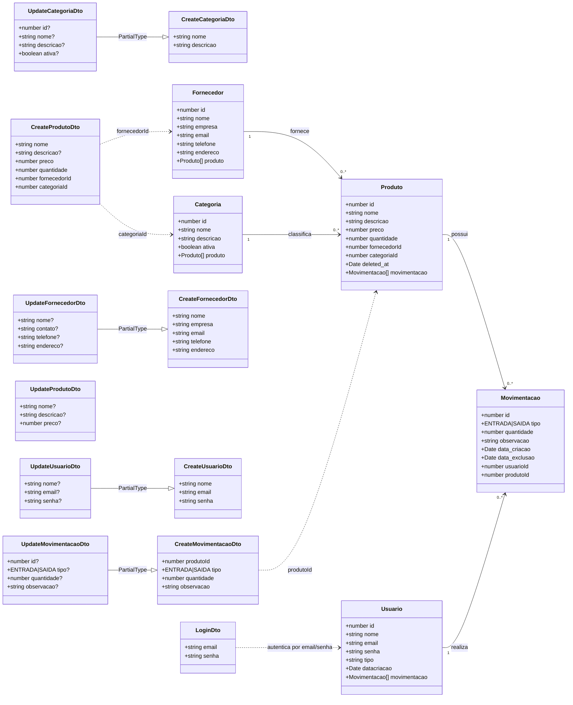
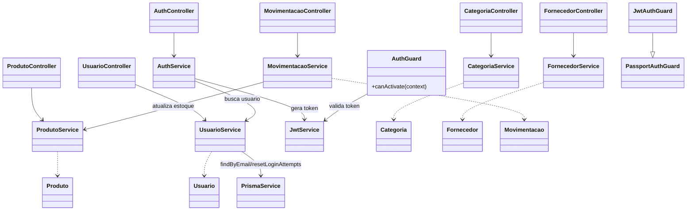

# Diagrama De Classes (Backend)

Este documento representa as classes principais do backend NestJS.

## 1) Dominio (Entidades E DTOs)

## 2) Camada De Aplicacao (Controller, Service, Auth)

## Observacoes

- O codigo contem imports mistos para algumas entidades (`src/fornecedor/fornecedor` e `src/fornecedor/entities/fornecedor.entity`, por exemplo).
- O projeto tambem mistura acesso via TypeORM e Prisma no `UsuarioService`.
- O diagrama acima reflete o estado atual do codigo, sem normalizacao arquitetural.
